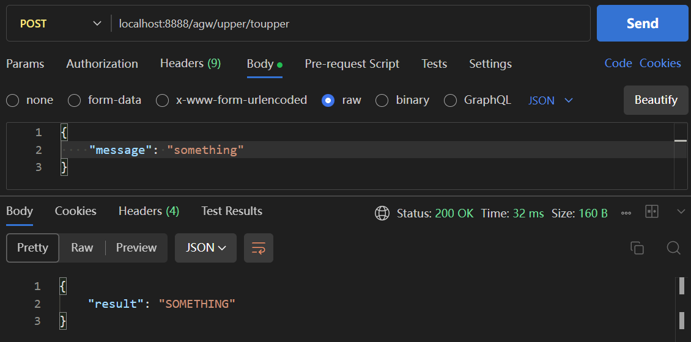

# API Gateway

## 简介

一个API网关，网关主体通过hertz实现，hertz server接收 HTTP 请求，通过 kitex 的 HTTP 泛化调用方式转换成 Thrift RPC 请求，发给内网的目标 kitex RPC 服务，并将结果转换成 JSON 返回给hertz客户端。

网关内通过 etcd 进行 RPC 服务发现，用并发安全的的sync.Map存储注册到网关的服务及其对应的泛化调用客户端，提供查询、更新、删除接口对服务和泛化调用客户端进行管理

## 部署方式与简单示例

1. 由于使用 etcd 进行服务发现，请在启动 网关 和 RPC servers 前启动 etcd，并确保 etcd 监听在 2379 端口

    ```bash
    $ etcd --log-level=debug
    ```

2. 项目根目录下有两个示例 kitex RPC servers:
   - upper: 服务名为upper，服务中有一个toupper方法, 用于将请求message转换为全大写后返回。监听端口为8890, 可通过 [localhost:8890/internal/toupper](localhost:8890/internal/toupper) 进行 kitex Thrift RPC 调用, 模拟内网的一个 RPC 微服务
   - lower: 基本同上，区别是将message转小写, 端口在8889
   
   可先启动upper（lower之后测试泛化调用增删改接口时再启动，热更新到网关中, 由于网关启动时会自动扫描./idl目录下的所有以.thrift结尾的idl文件，尝试构造泛化调用客户端, 此处可改一下lower.thrift的后缀或暂时删除，使网关不要自动加载）:
   ```bash
   $ cd ./rpc-server/upper
   $ go run .
   ```

3. 启动网关(网关监听再8888端口)
   ```bash
   $ cd ../../ # 回到项目根目录
   $ go run .
   ```
4. 发送 `GET localhost:8888/idl/list`请求, 可以看到upper已经成功被注册
   
   此时可正常发送服务请求 `POST localhost:8888/agw/upper/toupper`, 请求成功发送并被路由到正确的 RPC server，响应正常
   

5. 发送 `GET localhost:8888/agw/lower/tolower`请求, 由于此服务尚未注册, 会提示访问了未注册的服务
   

6. 检验泛化调用客户端增删改查接口及idl管理功能
   1. 启动lower服务，监听在8889端口
      ```bash
      $ cd ./rpc-server/lower
      $ go run .
      ```
   2. 确保要注册的服务对应的idl文件lower.thrift在./idl/目录下，调用 `POST /idl/update/lower`接口。该接口会自动识别该服务是否已存在，如不存在，则构造相应的泛化调用客户端，注册该服务；若已存在，则更新原有的泛化调用客户端:
      
   可以看到，由于是第一次注册该服务，响应为"lower服务被添加到网关"。
   3. 可尝试再次调用`POST /idl/update/lower`接口
   
   可以看到，由于服务已存在，响应为"服务被更新"。此功能可实现当idl文件更新时，不重启网关的情况下对泛化调用客户端的热更新。

   综上，该 POST 接口实现了增、改两个需求。
   此外，还可调用`DELETE /idl/delete/:servicename`删除已注册的服务（只删除sync.Map中存储的泛化调用客户端，idl文件应手动删除），调用`GET /idl/list`查询所有已注册的服务